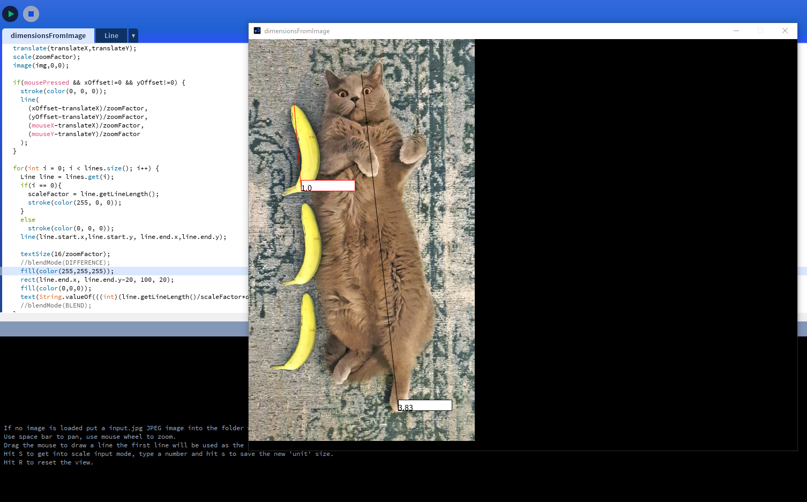

# dimensionsFromImageProcessing
Opens an input.jpg image and lets you draw lines to find dimensions

If no image is loaded put a input.jpg JPEG image into the folder with this program and open again.
 - Use space bar to pan, use mouse wheel to zoom.
 - Drag the mouse to draw a line the first line will be used as the ruler and is one 'unit'.
 - Hit S to get into scale input mode, type a number and hit s to save the new 'unit' size.
 - Hit R to reset the view.
 - Hit D to delete the previously drawn line.

## To run on linux
`sudo apt install openjdk-11-jdk`
or otherwise install java 11 on the machine (openjdk-11-jre is probably sufficient if not doing java work)

then run

`./application.linux/dimensionsFromImage`

## To run on windows
`./application.windows/dimensionsFromImage`

if Open JRE 11 isn't installed you should be promted to install it

## Prerequistes
To develop/build/run will need processing IDE

https://processing.org/
